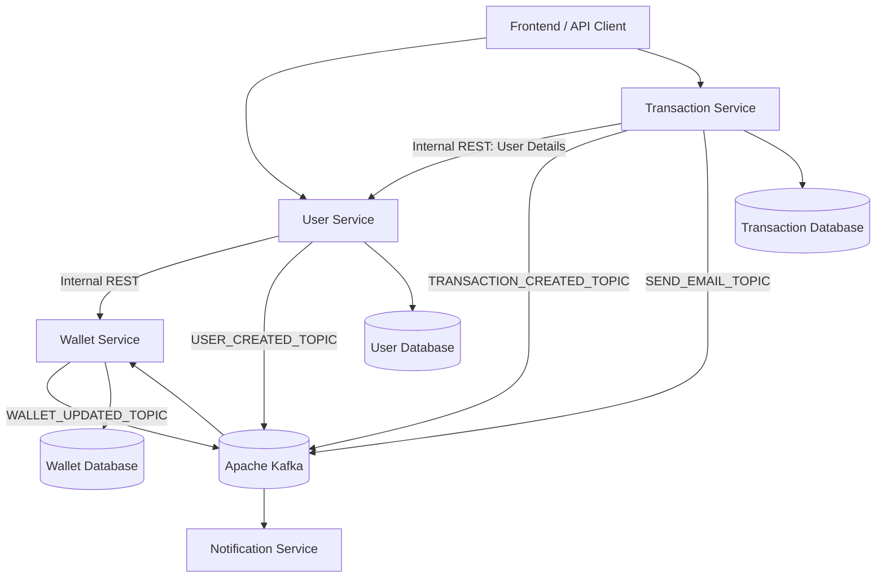

# eWallet Microservices

A microservices-based eWallet application built using **Java, Spring Boot, Apache Kafka, and Spring Security**. The application supports user registration and authentication, wallet management, money transfers, transaction tracking, and email notifications.

## Architecture

The application is divided into independent services that communicate using REST APIs and asynchronous Kafka messaging.



## Microservices

| Service | Responsibility |
|---|---|
| **User Service** | User registration, login, JWT authentication, profile management, and user details |
| **Wallet Service** | Wallet creation, balance management, and wallet updates |
| **Transaction Service** | Initiates transactions, retrieves transaction status, and coordinates transaction processing |
| **Notification Service** | Consumes Kafka messages and sends email notifications |
| **Utils** | Shared constants, DTOs, and enums used across services |

## Technologies Used

- Java
- Spring Boot
- Spring Security
- JSON Web Token (JWT)
- Apache Kafka
- Spring Data JPA
- Hibernate
- REST APIs
- RestTemplate
- Maven
- Relational database

## Key Features

### 1. User Management and Authentication
- User registration and login.
- Password encryption using Spring Security's password encoder.
- JWT-based authentication.
- Protected endpoints for authenticated users.
- User profile and account management.

### 2. Wallet Management
- Automatically creates a wallet when a user registers.
- Uses Kafka events for asynchronous wallet creation.
- Retrieves wallet details and balance.
- Updates wallet balances during transactions.

### 3. Transaction Processing
- Initiates transactions between users.
- Retrieves sender and receiver details through internal REST communication.
- Uses Kafka for asynchronous wallet updates.
- Handles successful and failed transaction outcomes.
- Tracks transaction status.

### 4. Email Notifications
- Consumes email notification events from Kafka.
- Sends transaction-related emails using Spring Mail.

### 5. Inter-Service Communication
- REST communication between User, Wallet, and Transaction services.
- Kafka-based asynchronous communication between services.
- Shared DTOs and constants through the Utils module.

## Application Flow

### User Registration

1. A user registers through the User Service.
2. User details are saved in the database.
3. User Service publishes a `USER_CREATED_TOPIC` event.
4. Wallet Service consumes the event and creates a wallet for the user.

### User Login

1. User submits login credentials.
2. User Service authenticates the user.
3. A JWT is generated and returned to the client.
4. The client uses the JWT to access protected endpoints.

### Money Transfer

1. The client initiates a transaction through the Transaction Service.
2. Transaction Service retrieves sender and receiver details from User Service using REST.
3. Transaction Service publishes a transaction event to Kafka.
4. Wallet Service consumes the event and processes the wallet balance updates.
5. Wallet Service publishes the wallet update result.
6. Transaction status is updated based on the processing result.

### Email Notification

1. A service publishes an email notification event to Kafka.
2. Notification Service consumes the event.
3. The email is sent using Spring Mail.

## Project Structure

```text
ewallet/
│
├── pom.xml
│
├── user-service/
│   ├── src/main/java/
│   └── pom.xml
│
├── wallet-service/
│   ├── src/main/java/
│   └── pom.xml
│
├── transaction-service/
│   ├── src/main/java/
│   └── pom.xml
│
├── notification-service/
│   ├── src/main/java/
│   └── pom.xml
│
├── utils/
│   ├── src/main/java/
│   └── pom.xml
│
└── README.md
```

## Getting Started

### Prerequisites

Make sure the following are installed:

- Java JDK
- Maven
- Apache Kafka
- A relational database supported by your application configuration
- Git

### Clone the Repository

```bash
git clone https://github.com/mahe-11/eWallet_Microservices.git
cd eWallet_Microservices
```

### Configure the Services

Configure the database connection, Kafka bootstrap server, email settings, and JWT secret in the respective service configuration files.

Configuration values should be supplied through environment variables or local configuration files. **Do not commit passwords, JWT secrets, or email credentials to GitHub.**

### Build the Project

From the root directory, run:

```bash
mvn clean install
```

### Run the Services

Start Kafka and the required database first.

Then run each Spring Boot service using its main application class, or from its module directory:

```bash
mvn spring-boot:run
```

Run the command separately for:

- `user-service`
- `wallet-service`
- `transaction-service`
- `notification-service`

Make sure each service has its own configured port and dependencies available before starting it.

## API Overview

The following are the main API areas. Refer to the controllers for the exact request and response formats.

| Service | Endpoint | Method | Description |
|---|---|---|---|
| User | `/user/register` | POST | Register a user |
| User | `/user/login` | POST | Authenticate and generate JWT |
| User | `/user/profile` | GET | Retrieve authenticated user profile |
| User | `/user/getUsers` | POST | Retrieve users by phone numbers |
| User | `/user/update` | PUT | Update user details |
| User | `/user/changePassword` | PATCH | Change password |
| Wallet | `/wallet/{phoneNumber}` | GET | Retrieve wallet details |
| Wallet | `/wallet/{phoneNumber}/balance` | GET | Retrieve wallet balance |
| Transaction | `/transaction/transact` | POST | Initiate a transaction |
| Transaction | `/transaction/transactionStatus/{transactionId}` | GET | Retrieve transaction status |

> Note: Wallet endpoints and any additional endpoints may depend on the current controller implementation. Update this table if your endpoint mappings change.

## Kafka Topics

The application uses Kafka for asynchronous communication.

| Topic | Purpose |
|---|---|
| `USER_CREATED_TOPIC` | Notifies Wallet Service when a user is registered |
| `TRANSACTION_CREATED_TOPIC` | Sends transaction details for wallet processing |
| `WALLET_UPDATED_TOPIC` | Publishes the result of wallet balance updates |
| `SEND_EMAIL_TOPIC` | Sends email notification requests to Notification Service |

## Future Improvements

- Add comprehensive unit and integration tests.
- Add API documentation using OpenAPI/Swagger.
- Improve centralized configuration and service discovery.
- Implement robust retry and dead-letter handling for Kafka consumers.
- Integrate a verified payment gateway for wallet deposits.
- Add Docker Compose support for running the complete application.
- Add centralized logging and monitoring.

## Author

**Mahesh Susladi**

GitHub: [mahe-11](https://github.com/mahe-11)

---

If you find this project useful, feel free to explore the repository and provide feedback.
